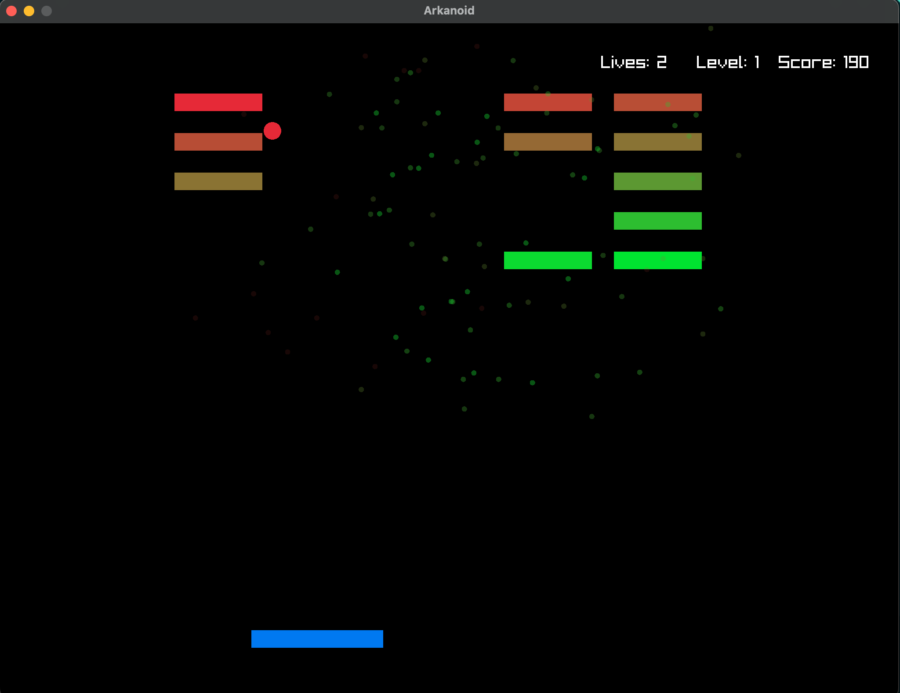

## Arkanoid

### Description

Arkanoid is a block breaker video game. Its plot involves the starship Arkanoid being attacked by a mysterious entity from space named DOH. A small paddle-shaped craft, the Vaus, is ejected from the Arkanoid.

### Features

- Particles on brick explosion
- Speed increase on level completion
- Brick color interpolation

### Controls

- Arrow keys to move
- Space to start

### License

Game sources are licensed under an unmodified zlib/libpng license, which is an OSI-certified, BSD-like license that allows static linking with closed source software. Check [LICENSE](LICENSE) for further details.

_Copyright (c) 2024 Alexander satretdinov_
